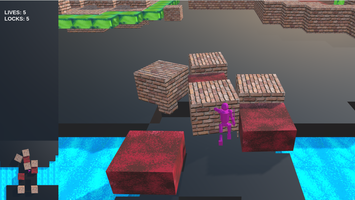

# Enviornment Generator
**A React application for creating levels for games that utilize a coordinate system. You can set the grid size and properties appropritate for your game**

### Example game
.

# Table of Contents
| [Overview](#Overview) | 
[Set up](#setup) | 
[React Components](#react) | 
[Models](#models) |

<a name = "Overview"/>

# Overview
Currently refactoring to make this a more compatible tool to use. Feel free to clone this repo and contact me for any questions you have. 

## Installation
* npm install
* npm run build
* npm run start

**Current functionality**

Out of the box this application allows users to create a level with types : 
## BLOCK TYPES 
None | Rock | Grass | Water | Lava | Goal | Start | Key | Lock | Enemy | Move |
---------|----------|---------|---------|----------|---------|----------|---------|---------|----------|---------|

As the user selects squares on the grid they can apply one of these block types to that square. When stored to the database there will be block models that contain the xy coordinates of the blocks, the level they belong to and their block type. Games that pull from the database can use this information to generate their scenes

<a name = "setup"/>

# Set Up 

You can simply npm install this to have it running as is. You may also change the packedge JSON project name to the name of your own project. 

<a name = "react"/>

# Front End
## Redux Reducers and React Containers/Components  

### Blocks

#### Components
**Block-component**: 

  Each square on the grid is a block component. This component has an id associated with it's x,y position on the grid which is used to change the CSS class of the table element based on it's game-type-property type.
**BlockSelect-component**:
  This is the component that contains the block types, updating the array terrainTypes will add potential game properties to your game.

**Block Container**:  
  This is a container for the block selector, keeps track of what block is selected and the properties that are added to that block.

 **grid-component**: 

  This creates a table where each square is a block-component.

 **grid-Gridcontainer**: 

  This is a smart component that handles the creation of game elements based on user selection. 

### Reducers

* **clearTable():** This action creator will clear the grid to its initial state.
* **loadBlocks(blocks):** This action creator will take in an array of blocks and sets the state blocks to that array.
* **toggleMulti():** This action creator will toggle wheter 
* **selectBlock(block):**
* **selectType(newTerrain):**
* **createBlock(block):**
* **changeType(newTerrain):**
* **submitLevel(name,blocks):**

<a name = "models"/>

#  
